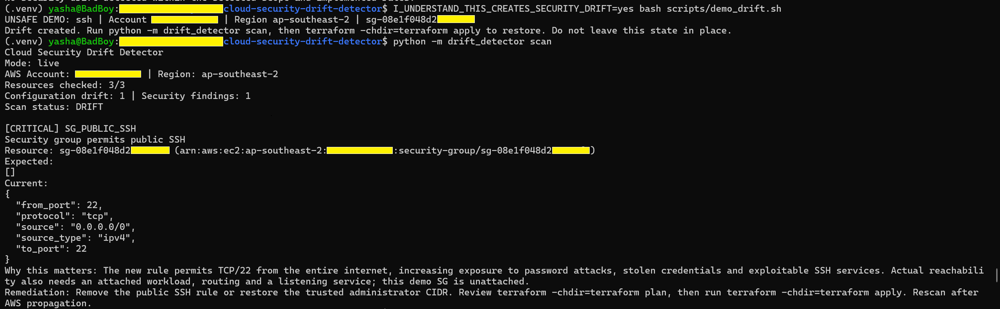
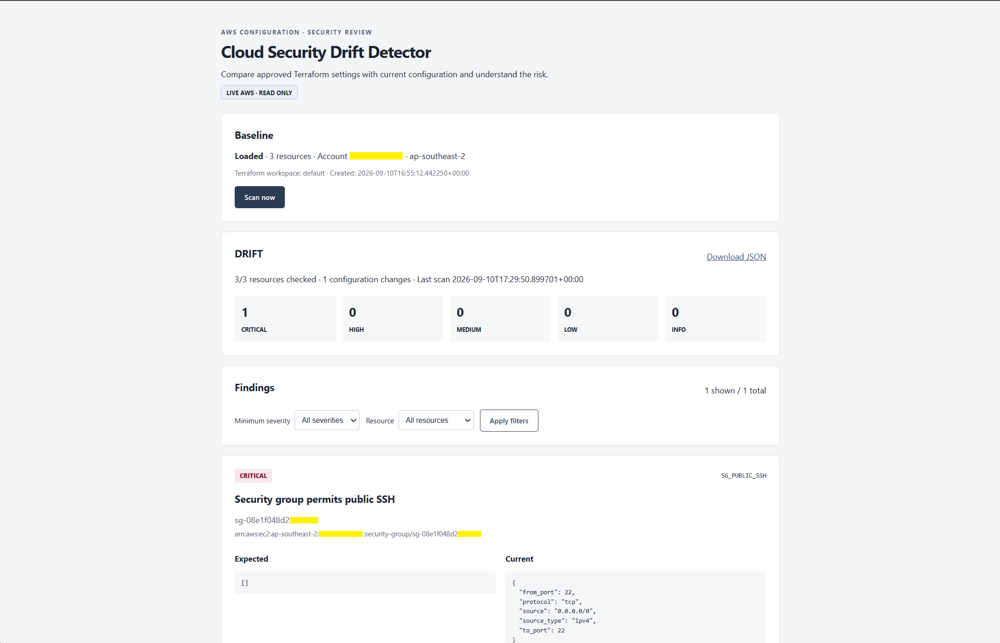
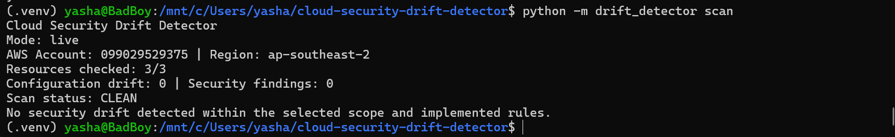
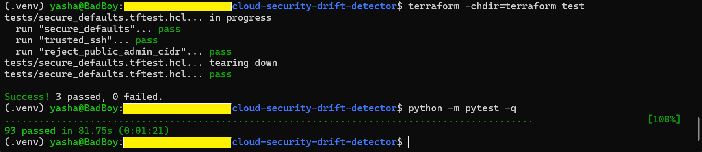
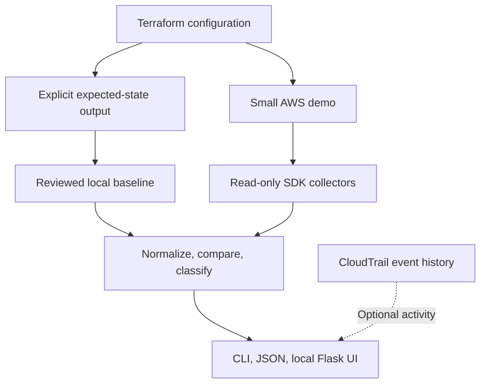

# Cloud Security Drift Detector

Terraform defines approved AWS settings. This read-only Python tool reads live S3, security group and IAM role configuration, compares it with a trusted Terraform-derived baseline, and explains the security risk of out-of-band changes. Findings include expected/current values, resource identity, severity and remediation. Optional CloudTrail activity supplies context without claiming causation.

**Start here: [SETUP_AND_TESTING.md](SETUP_AND_TESTING.md).** It includes WSL and PowerShell setup, exact success checks, deliberate drift, rollback, troubleshooting and teardown. Complete source is in this repository.


## Demo evidence

The screenshots below are from the validated project workflow: establish a clean live AWS baseline, introduce a controlled out-of-band security change, detect it, inspect it in the local web interface, restore the approved Terraform state, and verify the project tests.

### Live AWS scan — clean baseline


A live scan against the deployed AWS demo environment reports all three monitored resources checked, with no configuration drift and no security findings.

### Controlled drift — public SSH detected



The controlled demo adds an unauthorized `0.0.0.0/0` SSH rule to the unattached demonstration security group. The detector identifies the change as `SG_PUBLIC_SSH` with **CRITICAL** severity and shows the expected state, current state, risk explanation and remediation guidance.

### Local web interface — drift investigation



The local Flask interface presents scan state, finding severity, resource identity, expected/current values, explanation and remediation without exposing a cloud-facing application.

### Terraform restoration — clean again



After Terraform reconciles the out-of-band change, the same trusted baseline is used again and the scanner returns to a clean state. The baseline is not regenerated to hide the drift.

### Validation and tests



The repository includes Python tests and mocked Terraform tests so core detection, normalization and infrastructure assumptions can be validated without provisioning AWS resources for every test run.

### Demonstrated lifecycle

```text
       APPROVED TERRAFORM INTENT
                 │
                 ▼
        ┌─────────────────┐
        │ Trusted Baseline│
        └────────┬────────┘
                 │
                 │ compare
                 ▼
        ┌─────────────────┐
        │    Live AWS     │
        │  S3 / SG / IAM  │
        └────────┬────────┘
                 │
          ┌──────┴──────┐
          │             │
          ▼             ▼
      CLEAN          OUT-OF-BAND
      STATE            CHANGE
                          │
                          ▼
                 ┌─────────────────┐
                 │ Drift Detector  │
                 │ classify + risk │
                 └────────┬────────┘
                          │
               ┌──────────┴──────────┐
               ▼                     ▼
           CLI / JSON             Web UI
               │
               ▼
        Terraform reconcile
               │
               ▼
             CLEAN
```

## Quickstart: no AWS account needed

Extract the ZIP and open a terminal inside `cloud-security-drift-detector/`.

```bash
python3 -m venv .venv
source .venv/bin/activate
python -m pip install -e ".[dev,web]"
python -m drift_detector demo --clean
python -m drift_detector demo
python -m drift_detector serve --demo
```

Open **http://127.0.0.1:8787**. The `demo` command intentionally exits **1** when findings exist. This is a successful detection, not a crash. On PowerShell, create with `py -3 -m venv .venv` and activate with `.\.venv\Scripts\Activate.ps1`.

## Why this exists

`terraform plan` already detects infrastructure differences. This project adds a security interpretation: which control changed, whether it expands permissions or network exposure, how serious it is, and how to restore the approved settings. It monitors a deliberately small scope rather than collecting every Terraform property.

The baseline is **authored Terraform intent**, not a snapshot that silently accepts whatever happens to be live. Initial generation verifies that AWS agrees with that intent and refuses to overwrite an existing baseline without `--force`.

## Architecture



[Architecture and schema](docs/architecture.md) explain each layer. Python uses boto3, Pydantic, argparse and the standard library. Flask is an optional extra; the CLI does not import it. No database, frontend build, EC2 instances, NAT gateways or paid enterprise dependencies are required.

## What it detects

| Scope | Examples |
|---|---|
| S3 | Weakened public access blocks, public policy status, broad ACL grants, changed ownership, missing/changed encryption policy, suspended versioning, removed HTTPS enforcement |
| Security groups | Public SSH/RDP/database ports, full port ranges, IPv6 `::/0`, broadened CIDRs, unexpected ingress/egress |
| IAM roles | AdministratorAccess/FullAccess additions, other attachments, new inline policies, changed managed-policy default versions, wildcard Allows, negated Allows, policy removals, trust changes, selected escalation-capable permissions |
| Operations | Missing resources, incomplete reads, account/region mismatch, malformed/corrupt baseline, protected baseline replacement |

See [all implemented rules](docs/security-rules.md). Classification is deterministic and extensible. Configuration deltas and security findings are distinct: deleting an allowed ingress rule produces a configuration delta, but no exposure finding. The baseline still rejects that delta during initial verification.

## Requirements and installation

- Python **3.11+**; Python 3.12 is used in the recorded local validation.
- For AWS: AWS CLI v2, Terraform **1.9+ and <2**, a disposable AWS account or sandbox, and permissions to provision the listed resources.
- Network access for package/provider downloads; the installed offline demo itself makes no AWS calls.
- WSL Ubuntu is the recommended Windows development environment. Native PowerShell commands are also documented.

```bash
python -m pip install -e ".[dev,web]"
```

Only need the CLI? `python -m pip install -e .`. Run commands from the repository root unless a command explicitly changes directories. Make shortcuts are optional.

## AWS authentication and deployment

Use the AWS credential chain: an SSO/shared-config profile, environment-provided temporary credentials, or an IAM role. Never embed keys in code. The provisioner and the scanner are separate roles in a least-privilege deployment.

```bash
aws configure sso --profile drift-demo
aws sso login --profile drift-demo
export AWS_PROFILE=drift-demo
export AWS_DEFAULT_REGION=ap-southeast-2
aws sts get-caller-identity
cp terraform/terraform.tfvars.example terraform/terraform.tfvars
terraform -chdir=terraform init
terraform -chdir=terraform plan
terraform -chdir=terraform apply
python -m drift_detector baseline
python -m drift_detector scan
```

If the account does not use IAM Identity Center, use an existing appropriately scoped profile or approved temporary role credentials. `aws configure --profile drift-demo` supports shared credentials, but permanent users/keys are not the preferred approach.

Terraform creates an empty private S3 bucket, a tiny isolated VPC, an unattached security group, and an unused Lambda-trusted IAM demo role with limited bucket-read permissions. It also closes the VPC's default group. By default the monitored SG has **no ingress and no egress**. Optional trusted IPv4 SSH and expected public HTTPS are explicit variables.

No actual Lambda function, compute instance, public IP, subnet, internet gateway or NAT is deployed. The optional CloudTrail setting uses existing event history; it creates no trail or log bucket. S3 requests/storage and normal AWS account charges can still apply; see [cost and cleanup guidance](SETUP_AND_TESTING.md#10-clean-up-aws-resources).

## Baseline generation

```bash
python -m drift_detector baseline
# After an intentional Terraform configuration change and apply:
python -m drift_detector baseline --force
```

The default path is `.baseline/security_baseline.json`. Its account, region, workspace, resource identifiers and normalized settings are validated before use. Initial generation reads `terraform output -json`, compares live AWS with that expected contract, and saves only after a complete match. It does not copy drifted live values into the baseline.

A saved full output export can be read with `--terraform-output PATH`. `--skip-live-verification` exists for explicitly reviewed offline exports and prints a warning; it does not turn a live snapshot into Terraform intent. An embedded SHA-256 checksum detects accidental corruption, **not authenticity against someone who can edit the file and recompute the hash**. Protect the baseline and Terraform source together.

Do not regenerate a baseline to make an unexplained alert disappear. Review/apply the intended configuration first. State refresh is not remediation.

## CLI and JSON reports

```bash
python -m drift_detector scan
python -m drift_detector scan --resource security_group --severity high
python -m drift_detector scan --format json --output reports/scan.json --fail-on high
python -m drift_detector scan --cloudtrail
python -m drift_detector scan --no-cloudtrail
python -m drift_detector demo --clean
python -m drift_detector demo
python -m drift_detector --help
python -m drift_detector scan --help
```

| Exit | Meaning |
|---|---|
| `0` | Complete selected scope; no finding reaches `--fail-on` (default INFO) |
| `1` | Complete scan; at least one finding reaches the threshold |
| `2` | Configuration error or incomplete scan; this is never clean |

`--resource` changes collection scope. `--severity` only filters displayed findings; it cannot hide an error or change the exit threshold. Report totals count all findings within the selected resource scope, and `displayed_findings` states the filtered count. One policy change can trigger several rules: finding count is not the count of unique changes.

Example clean output:

```text
Cloud Security Drift Detector
Mode: offline-demo
AWS Account: 123456789012 | Region: ap-southeast-2
Resources checked: 3/3
Configuration drift: 0 | Security findings: 0
Scan status: CLEAN
No security drift detected within the selected scope and implemented rules.
```

The supplied drift fixture produces **6 findings: 2 CRITICAL and 4 HIGH** across three configuration deltas. Public SSH includes the exact atomic rule, the approved ingress list, the risk to a reachable service, and steps to remove the rule. It does not claim the unattached demo SG represents an already reachable server.

## Controlled live demo and restore

Use only the disposable resources from this Terraform project. The mutation script is separate from the scanner and requires a deliberate acknowledgement.

```bash
I_UNDERSTAND_THIS_CREATES_SECURITY_DRIFT=yes bash scripts/demo_drift.sh
python -m drift_detector scan
bash scripts/restore.sh
```

The default script checks demo tags and refuses to open SSH when the group is attached to a network interface. Optional `--scenario s3` disables one bucket public-access guard. Optional `--scenario iam` attaches AdministratorAccess to the unused demo role; this needs stronger care and quick restoration. Both require the acknowledgement too. See [the demo runbook](docs/demo.md).

Terraform deliberately uses **exclusive ownership** of the monitored SG's inline rules and the demo role's inline/managed policy sets so `apply` can remove unexpected additions. The detector merely recommends changes. Terraform apply and the explicit demo script are the only mutation paths in the documented flow.

## Local web UI

```bash
python -m drift_detector serve --demo
# Or, with a real baseline and AWS profile:
python -m drift_detector serve
```

Use the scan button, optional offline clean/drifted scenario, minimum-severity/resource filters and JSON download. Cards show the rule ID, ARN/ID, expected/current values, explanation, remediation and any CloudTrail context. All scans use the CLI's service layer. It binds to `127.0.0.1:8787`, disables debugger/reloader, restricts host headers and uses CSRF tokens. There is no cloud-facing login system; keep it local.

## CloudTrail context

Set `enable_cloudtrail = true` before deploying/baselining, or use `scan --cloudtrail` with the additional read permission. The collector looks up resource-name activity over the previous 24 hours, caps each lookup at 100 events, filters read-only/failed operations and displays up to five possible related writes per resource. IAM activity is looked up in the partition's global-service home region; regional resources use the configured region.

No trail is required for event-history lookup. Event history is regional and retains 90 days of management activity; delivery/indexing delays and imperfect resource-name indexing mean a missing event is inconclusive. Permission failures become warnings without disabling core detection. [AWS event-history documentation](https://docs.aws.amazon.com/awscloudtrail/latest/userguide/view-cloudtrail-events.html)

## Scanner permissions and CI/CD

Export the exact scoped read policy after deployment:

```bash
python scripts/export_config.py scanner-policy --output .baseline/scanner-policy.json
```

Attach that policy to a **separate scanner identity**, not the monitored demo role. EC2 DescribeSecurityGroups and optional CloudTrail LookupEvents require wildcard resources; EC2 reads are region-constrained. IAM managed-policy reads cover AWS-managed policies and policies in this account so unexpected attachments can be inspected. The S3 encryption permission is `s3:GetEncryptionConfiguration`, which differs from its API method name. [AWS API reference](https://docs.aws.amazon.com/AmazonS3/latest/API/API_GetBucketEncryption.html)

- `ci.yml`: lint, format, Python tests, wheel build and installed-wheel demo; no AWS credentials.
- `terraform.yml`: format, initialization, validation and mock-provider Terraform plans; no real apply.
- `drift-scan.yml`: opt-in scheduled/manual real scan using OIDC, a protected baseline secret, JSON artifact and configurable failure threshold. No deployment and no baseline regeneration.

[GitHub Actions and OIDC setup](docs/github-actions.md) provides exact configuration, identity separation and baseline persistence. Workflow actions are pinned to immutable SHAs. Monthly Dependabot checks propose reviewed updates.

## Tests and validation

```bash
python -m ruff check .
python -m ruff format --check .
python -m pytest --cov=drift_detector
terraform -chdir=terraform fmt -check -recursive
terraform -chdir=terraform init -backend=false -input=false -lockfile=readonly
terraform -chdir=terraform validate
terraform -chdir=terraform test
```

Python tests use botocore Stubber and explicit fixtures; they do not require AWS. Terraform tests use Terraform mock providers. [VALIDATION.md](VALIDATION.md) distinguishes recorded local checks from the real AWS acceptance steps still requiring your account. Provider pins and `.terraform.lock.hcl` are committed; `.terraform/`, state, local baselines, real tfvars and reports are excluded.

## Security considerations and limitations

This is a scoped drift detector, not a GuardDuty replacement, CSPM platform, SIEM, vulnerability scanner or runtime intrusion detector. [Threat model](docs/threat-model.md) documents trust boundaries.

It evaluates bucket-level settings, not every object ACL, access point or account-wide control. Modern S3 automatically encrypts new uploads with SSE-S3; missing encryption configuration does not prove plaintext storage. A KMS policy change concerns key control, and default encryption does not describe every historical object. [AWS encryption FAQ](https://docs.aws.amazon.com/AmazonS3/latest/userguide/default-encryption-faq.html)

IAM rules are heuristics, not a complete AWS authorization simulator: SCPs, permissions boundaries, session policies, resource policies and all escalation chains are outside scope. SG checks do not establish routes, listeners or end-to-end reachability; prefix list contents are not expanded. Policy canonicalization removes ordering, array/scalar and Sid differences but does not prove arbitrary Boolean/logical equivalence. AWS changes during a multi-call scan can produce a transient mixed snapshot; rescan after propagation.

Terraform outputs depend on using the correct applied workspace/configuration. A malicious baseline/source editor can defeat the comparison. Baselines, reports and CloudTrail context contain account/actor metadata; review before publishing. `--debug` exposes application traces, while SDK credential-level debug logging stays disabled.

## Cleanup

```bash
terraform -chdir=terraform plan -destroy
terraform -chdir=terraform destroy
```

Keep the bucket empty. `force_destroy=false` deliberately prevents silently deleting object versions. If data was added, review and delete **all versions and delete markers** using the console before retrying. Separate OIDC scanner roles created from the optional guide need separate cleanup. Disable the scheduled scan before destroying resources.

MIT licensed. Full file inventory: [PROJECT_FILES.md](PROJECT_FILES.md).
